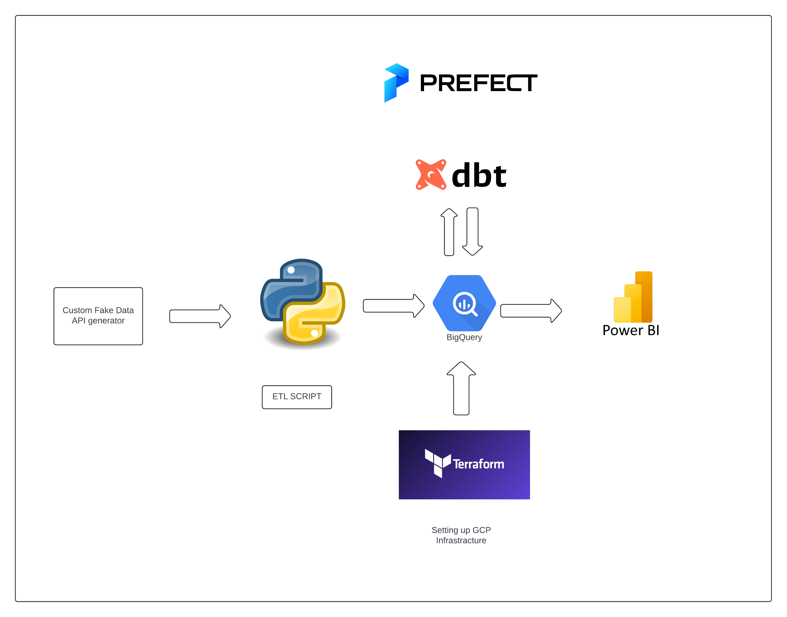
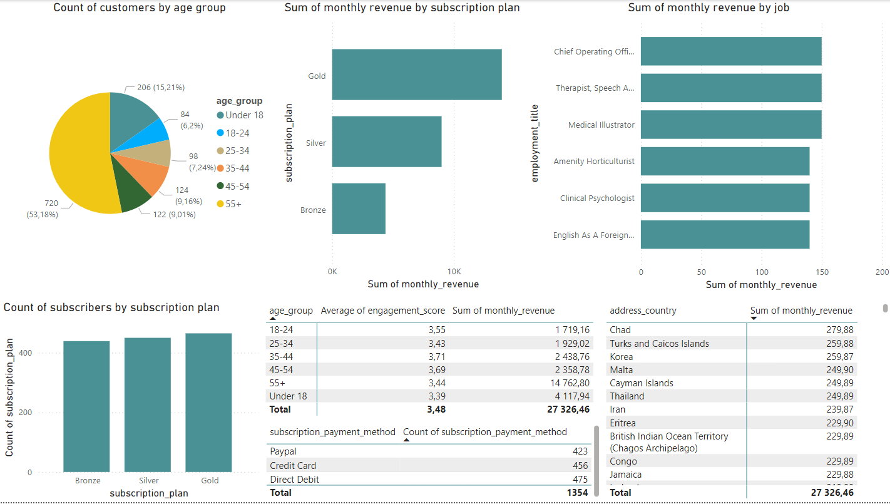

# API_DE_PROJECT

## Table of Contents

- [Project Overview](#project-overview)
- [Project Architecture](#project-architecture)
- [Power BI Dashboard](#power-bi-dashboard)
- [Prerequisites](#prerequisites)
- [Setup](#setup)
- [License](#license)
- [Acknowledgments](#acknowledgments)
## Project Overview

This project demonstrates a comprehensive data engineering pipeline that generates fake customer data, processes it through various stages, and ultimately visualizes it in a Power BI dashboard. The pipeline utilizes modern data engineering tools and practices, including custom API development, ETL processes, data warehousing, and orchestration.

## Project Architecture



## Power BI Dashboard



## Prerequisites

Before you begin, ensure you have the following installed:

- [Terraform](https://www.terraform.io/downloads.html) (v1.0+)
- [Google Cloud SDK](https://cloud.google.com/sdk/docs/install)
- [Python](https://www.python.org/downloads/) (v3.8+)
- [Power BI Desktop](https://powerbi.microsoft.com/desktop/)

## Setup

### 1. Clone the Repository

First, clone the repository to your local machine:
```bash
git clonehttps://github.com/KarolG002/API_DE_Project.git
cd API_DE_PROJECT
```

### 2. Set up terraform
```bash
cd terraform
```
Supply your own project id and key and then:
```bash
terraform init

terraform apply
```

#### To tear down infrastracture
```bash
terraform destroy
```

### 3. Install Python Dependencies
```bash
python -m venv venv
source venv/bin/activate  # On Windows use `venv\Scripts\activate`
pip install -r requirements.txt

```
### 4. Set up Prefect
```bash
prefect server start
```

### 5. Set up API server
```bash
python src/pipeline/createapi.py
```

### 6. Run the load to bigquery data pipeline
```bash
python src/pipeline/main.py
```

### 7. Run dbt
```bash
dbt run
```

### 8. Set Up Power BI
Open Power BI Desktop.

Connect to your BigQuery dataset using the BigQuery Connector.

Create your visualizations based on the data available in the BigQuery tables.


## License
This project is licensed under the MIT License. See the LICENSE file for details.

## Acknowledgments

The dataset used in this project was acquired from [Kaggle.com](https://www.kaggle.com/datasets/budnyak/wine-rating-and-price)

Thanks to the open-source community for the tools and libraries used in this project.